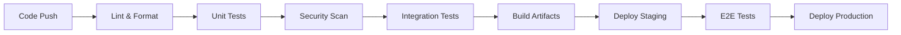

# GitHub Flow Best Practices for Enterprise Environments

## 📋 Table of Contents
1. [GitHub Flow Overview](#github-flow-overview)
2. [Branch Management](#branch-management)
3. [Commit Standards](#commit-standards)
4. [Pull Request Process](#pull-request-process)
5. [Code Review Guidelines](#code-review-guidelines)
6. [Repository Configuration](#repository-configuration)
7. [Security & Compliance](#security--compliance)
8. [Automation & CI/CD](#automation--cicd)
9. [Team Collaboration](#team-collaboration)
10. [Troubleshooting](#troubleshooting)

---

## 🔄 GitHub Flow Overview

### Core Principles
- **Main branch is always deployable** - Production-ready code only
- **Feature branches for all changes** - No direct commits to main
- **Pull requests for code review** - Mandatory peer review process
- **Automated testing required** - All tests must pass before merge
- **Descriptive commit messages** - Clear history and documentation

### Enterprise Benefits
- **Reduced Risk** - Isolated development prevents production issues
- **Quality Assurance** - Mandatory reviews and automated testing
- **Audit Trail** - Complete history of changes and approvals
- **Team Collaboration** - Structured review and discussion process
- **Compliance** - Meets SOX, GDPR, and other regulatory requirements

---

## 🌳 Branch Management

### Branch Naming Conventions

#### **Feature Branches**
```
feature/descriptive-name
feature/user-authentication
feature/payment-integration
feature/dashboard-analytics
```

#### **Bug Fix Branches**
```
bugfix/issue-description
bugfix/login-error-handling
bugfix/memory-leak-fix
bugfix/api-timeout-issue
```

#### **Hotfix Branches** (Critical Production Issues)
```
hotfix/critical-security-patch
hotfix/production-outage-fix
hotfix/data-corruption-repair
```

#### **Release Branches** (If using release cycles)
```
release/v1.2.0
release/2024-q1-release
release/major-feature-launch
```

### Branch Management Commands

#### **Creating Feature Branch**
```bash
# Start from latest main
git checkout main
git pull origin main

# Create and switch to feature branch
git checkout -b feature/enterprise-workflow-improvements

# Push branch to remote and set upstream
git push -u origin feature/enterprise-workflow-improvements
```

#### **Keeping Branch Updated**
```bash
# Regular sync with main (recommended daily)
git checkout main
git pull origin main
git checkout feature/your-feature
git merge main  # or git rebase main for cleaner history

# Push updates
git push origin feature/your-feature
```

#### **Branch Cleanup**
```bash
# After PR is merged, clean up local branches
git checkout main
git pull origin main
git branch -d feature/your-feature  # Delete local branch
git remote prune origin              # Clean up remote references
```

---

## 📝 Commit Standards

### Conventional Commits Format
```
<type>[optional scope]: <description>

[optional body]

[optional footer(s)]
```

### Commit Types (Enterprise Standard)

#### **Primary Types**
- `feat:` - New feature for users
- `fix:` - Bug fix for users
- `docs:` - Documentation changes
- `style:` - Code formatting (no logic changes)
- `refactor:` - Code restructuring (no feature/bug changes)
- `perf:` - Performance improvements
- `test:` - Adding or modifying tests
- `chore:` - Maintenance tasks, dependency updates

#### **Enterprise-Specific Types**
- `security:` - Security-related changes
- `compliance:` - Regulatory compliance updates
- `infra:` - Infrastructure changes
- `config:` - Configuration updates
- `deploy:` - Deployment-related changes

### Commit Examples

#### **Good Commit Messages**
```bash
feat(auth): implement multi-factor authentication

- Add TOTP support using authenticator apps
- Integrate with corporate LDAP directory
- Include backup codes for account recovery
- Update security policy documentation

Closes #1234
Reviewed-by: Security-Team
```

```bash
fix(api): resolve timeout issues in payment processing

- Increase connection timeout to 30 seconds
- Add retry logic for transient failures
- Improve error handling and user feedback
- Add monitoring for payment API performance

Fixes #5678
Security-Impact: None
```

#### **Poor Commit Messages (Avoid)**
```bash
# Too vague
fix: bug fix
update: changes
misc: stuff

# No context
WIP
tmp
test

# Not descriptive
fixed it
updated files
changes
```

### Commit Best Practices

#### **Atomic Commits**
- One logical change per commit
- All tests should pass after each commit
- Related files should be committed together

#### **Commit Message Guidelines**
```bash
# Use imperative mood (command form)
✅ "Add user authentication"
❌ "Added user authentication"
❌ "Adding user authentication"

# Be specific and descriptive
✅ "Fix memory leak in image processing pipeline"
❌ "Fix bug"

# Reference issues and PRs
✅ "Closes #123, Fixes #456"
✅ "Related to #789"
```

---

## 🔄 Pull Request Process

### PR Creation Checklist

#### **Before Creating PR**
- [ ] Branch is up to date with main
- [ ] All tests pass locally
- [ ] Code follows style guidelines
- [ ] Documentation is updated
- [ ] Self-review completed
- [ ] Related issues identified

#### **PR Template Structure**
```markdown
## Summary
Brief description of changes and motivation

## Changes Made
### Added
- New features or functionality

### Changed  
- Modified existing functionality

### Fixed
- Bug fixes and corrections

### Removed
- Deprecated or deleted functionality

## Testing
### Automated Tests
- [ ] Unit tests pass
- [ ] Integration tests pass
- [ ] E2E tests pass

### Manual Testing
- [ ] Feature tested in dev environment
- [ ] Edge cases verified
- [ ] Performance impact assessed

## Security Review
- [ ] No hardcoded secrets
- [ ] Input validation implemented
- [ ] Authorization checks in place
- [ ] Security scan results reviewed

## Breaking Changes
- None / List any breaking changes

## Documentation
- [ ] Code comments updated
- [ ] API documentation updated
- [ ] User documentation updated
- [ ] Migration guide provided (if needed)

## Reviewers
- @technical-lead (required)
- @security-team (for security changes)
- @devops-team (for infrastructure changes)

## Post-Merge Checklist
- [ ] Deploy to staging environment
- [ ] Monitor for errors
- [ ] Update project documentation
- [ ] Close related issues
```

### PR Commands

#### **Creating Pull Request**
```bash
# Using GitHub CLI (recommended)
gh pr create \
  --title "feat: implement enterprise user management" \
  --body-file PR_TEMPLATE.md \
  --assignee your-username \
  --reviewer team-lead,security-team \
  --label "enhancement,security-review"

# Traditional approach
# Push branch and use GitHub web interface
git push origin feature/your-feature
# Then create PR through GitHub web UI
```

#### **PR Management**
```bash
# View PR status
gh pr status

# Check PR details
gh pr view 123

# Add reviewers
gh pr edit 123 --add-reviewer @security-team

# Add labels
gh pr edit 123 --add-label "security,high-priority"

# Merge PR (after approval)
gh pr merge 123 --squash --delete-branch
```

---

## 👥 Code Review Guidelines

### Review Checklist

#### **Functionality Review**
- [ ] Code accomplishes stated objectives
- [ ] Logic is correct and efficient
- [ ] Error handling is comprehensive
- [ ] Edge cases are considered
- [ ] Performance impact is acceptable

#### **Code Quality Review**
- [ ] Code is readable and well-structured
- [ ] Naming conventions are followed
- [ ] Comments explain complex logic
- [ ] No code duplication
- [ ] Design patterns are appropriate

#### **Security Review**
- [ ] No hardcoded credentials or secrets
- [ ] Input validation and sanitization
- [ ] Proper authentication/authorization
- [ ] Secure data transmission/storage
- [ ] No SQL injection vulnerabilities

#### **Testing Review**
- [ ] Adequate test coverage (>80%)
- [ ] Tests cover happy path and edge cases
- [ ] Test names are descriptive
- [ ] No flaky or unreliable tests
- [ ] Integration tests for complex features

### Review Process

#### **Review Assignment Rules**
1. **Automatic Assignment** - Based on CODEOWNERS file
2. **Required Reviewers** - Minimum number based on file sensitivity
3. **Security Team** - Required for security-sensitive changes
4. **Architecture Team** - Required for major design changes

#### **Review Timeline (Enterprise SLA)**
- **Standard Changes**: 2 business days
- **Critical Fixes**: 4 hours
- **Security Patches**: 2 hours
- **Emergency Hotfixes**: 1 hour

#### **Review Comments Best Practices**
```markdown
# Constructive feedback format
**Issue**: The current implementation has a potential memory leak
**Suggestion**: Consider using a context manager or try/finally block
**Reference**: See https://docs.python.org/3/library/contextlib.html

# Categorize comments
🚨 **BLOCKER**: Must be fixed before merge
⚠️ **CONCERN**: Should be addressed
💭 **SUGGESTION**: Optional improvement
ℹ️ **INFO**: General information or question
```

---

## ⚙️ Repository Configuration

### Branch Protection Rules

#### **Main Branch Protection**
```yaml
Branch Protection Settings:
  Branch Name Pattern: main
  
  Restrictions:
    ✅ Require pull request before merging
    ✅ Require approvals: 2
    ✅ Dismiss stale reviews when new commits are pushed
    ✅ Require review from code owners
    ✅ Require status checks to pass before merging
    ✅ Require branches to be up to date before merging
    ✅ Require conversation resolution before merging
    ✅ Require signed commits (recommended)
    ✅ Require linear history
    ✅ Include administrators
    ❌ Allow force pushes
    ❌ Allow deletions

  Required Status Checks:
    - ci/code-quality
    - ci/security-scan
    - ci/tests
    - ci/build
```

#### **Develop Branch Protection** (if using)
```yaml
Branch Protection Settings:
  Branch Name Pattern: develop
  
  Restrictions:
    ✅ Require pull request before merging
    ✅ Require approvals: 1
    ✅ Require status checks to pass before merging
    ❌ Require branches to be up to date
    ❌ Allow force pushes
    ❌ Allow deletions
```

### Repository Settings

#### **General Settings**
```yaml
Repository Settings:
  Default Branch: main
  Features:
    ✅ Allow merge commits
    ✅ Allow squash merging (preferred)
    ✅ Allow rebase merging
    ✅ Always suggest updating pull request branches
    ✅ Automatically delete head branches
    ✅ Allow auto-merge

  Archives:
    ✅ Include Git LFS objects in archives
```

#### **Security Settings**
```yaml
Security Features:
  ✅ Enable vulnerability alerts
  ✅ Enable automated security updates
  ✅ Enable dependency graph
  ✅ Enable secret scanning
  ✅ Enable push protection for secrets
  
Code Scanning:
  ✅ Enable CodeQL analysis
  ✅ Enable third-party security tools
```

### CODEOWNERS File
```bash
# Enterprise CODEOWNERS example
# Global owners
* @enterprise-team @tech-leads

# Frontend code
/frontend/ @frontend-team @ui-ux-team

# Backend code
/backend/ @backend-team @api-team

# Infrastructure
/infrastructure/ @devops-team @security-team
/.github/ @devops-team
/docker/ @devops-team

# Security sensitive
/auth/ @security-team @backend-team
/payment/ @security-team @backend-team @compliance-team

# Documentation
/docs/ @tech-writers @product-team
README.md @tech-writers @product-team
```

---

## 🔒 Security & Compliance

### Security Scanning Setup

#### **Required Security Tools**
```yaml
Security Scanning Pipeline:
  - Static Analysis (SAST): SonarQube, CodeQL
  - Dependency Scanning: Dependabot, Snyk
  - Secret Scanning: GitHub Secret Scanning, GitLeaks
  - Container Scanning: Trivy, Clair
  - License Compliance: FOSSA, BlackDuck
```

#### **Security Workflows**
```yaml
# .github/workflows/security.yml
name: Security Scan
on:
  pull_request:
    branches: [main, develop]
  schedule:
    - cron: '0 2 * * *'  # Daily at 2 AM

jobs:
  security-scan:
    runs-on: ubuntu-latest
    steps:
      - uses: actions/checkout@v4
      - name: Run security scan
        uses: securecodewarrior/github-action-add-sarif@v1
```

### Compliance Requirements

#### **Audit Trail**
- **All changes tracked** in pull requests
- **Reviewer approval** required for sensitive changes
- **Automated compliance** checks in CI/CD
- **Retention policies** for logs and artifacts

#### **Data Protection**
```markdown
GDPR/Privacy Compliance:
- No PII in code or logs
- Data encryption requirements
- Access control validation
- Data retention policies
- Right to be forgotten implementation
```

---

## 🤖 Automation & CI/CD

### Automated Workflows

#### **Pull Request Automation**
```yaml
# Auto-assign reviewers based on files changed
# Auto-label PRs based on content
# Auto-run tests and security scans
# Auto-update status checks
# Auto-merge when conditions met
```

#### **Branch Automation**
```yaml
# Auto-delete merged branches
# Auto-create release branches
# Auto-tag releases
# Auto-deploy to staging/production
# Auto-notify teams of changes
```

### CI/CD Pipeline Structure

#### **Pipeline Stages**


#### **Quality Gates**
```yaml
Quality Gates (Must Pass):
  - Code Coverage: >80%
  - Security Scan: No critical issues
  - Performance Tests: <2s response time
  - Accessibility: WCAG AA compliance
  - Documentation: All APIs documented
```

---

## 👥 Team Collaboration

### Communication Protocols

#### **PR Communication**
```markdown
Communication Guidelines:
- Tag relevant team members in PRs
- Use clear, constructive feedback
- Respond to review comments within 24 hours
- Resolve conversations before requesting re-review
- Use GitHub discussions for design questions
```

#### **Notification Setup**
```yaml
Notification Channels:
  Critical Issues: Slack + Email + SMS
  PR Reviews: Slack + Email
  Deployments: Slack + Dashboard
  Security Alerts: Slack + Email + PagerDuty
```

### Team Workflow

#### **Daily Development Flow**
```markdown
Morning Routine:
1. Pull latest changes from main
2. Review assigned PRs
3. Check CI/CD pipeline status
4. Update current feature branch
5. Begin development work

Evening Routine:
1. Commit and push daily progress
2. Create/update PR if ready
3. Review team's PRs
4. Update project documentation
5. Plan next day's work
```

#### **Sprint Integration**
```markdown
Sprint Planning Integration:
- Feature branches align with user stories
- PR acceptance criteria match story definitions
- Code review includes product owner when needed
- Demo prep includes PR walkthroughs
- Retrospectives include GitHub Flow feedback
```

---

## 🔧 Troubleshooting

### Common Issues & Solutions

#### **Merge Conflicts**
```bash
# Resolve merge conflicts
git checkout feature/your-branch
git fetch origin
git merge origin/main

# Resolve conflicts manually, then:
git add .
git commit -m "resolve: merge conflicts with main"
git push origin feature/your-branch
```

#### **Failed Status Checks**
```bash
# Re-run failed checks
gh workflow run ci.yml --ref feature/your-branch

# Debug locally
npm test          # Run tests locally
npm run lint      # Check linting
npm run build     # Verify build
```

#### **PR Blocked by Reviews**
```markdown
Review Process Issues:
- Ping reviewers in Slack if >48 hours
- Break large PRs into smaller ones
- Add more context in PR description
- Request specific feedback on concerns
- Escalate to team lead if needed
```

### Emergency Procedures

#### **Hotfix Process**
```bash
# Emergency production fix
git checkout main
git pull origin main
git checkout -b hotfix/critical-security-patch

# Make minimal fix
git add .
git commit -m "hotfix: patch critical security vulnerability"
git push -u origin hotfix/critical-security-patch

# Create emergency PR
gh pr create --title "HOTFIX: Critical Security Patch" \
  --body "Emergency fix for production security issue" \
  --assignee @security-team \
  --reviewer @tech-lead,@security-team \
  --label "hotfix,critical,security"
```

#### **Rollback Procedures**
```bash
# Revert problematic merge
git revert -m 1 <merge-commit-sha>
git push origin main

# Create rollback PR
gh pr create --title "revert: rollback problematic deployment" \
  --body "Rolling back changes causing production issues"
```

---

## 📊 Success Metrics

### Key Performance Indicators

#### **Development Velocity**
- Average time from PR creation to merge
- Number of PRs merged per sprint
- Code review turnaround time
- Deployment frequency

#### **Quality Metrics**
- Defect escape rate to production
- Code coverage percentage
- Security vulnerability count
- Technical debt reduction

#### **Team Collaboration**
- PR review participation rate
- Cross-team code reviews
- Knowledge sharing sessions
- Process improvement suggestions

### Continuous Improvement

#### **Regular Reviews**
```markdown
Weekly Team Reviews:
- Review GitHub Flow process effectiveness
- Identify bottlenecks and friction points
- Collect feedback on tooling and automation
- Plan process improvements

Monthly Metrics Review:
- Analyze development velocity trends
- Review security and quality metrics
- Assess team collaboration effectiveness
- Update processes based on learnings
```

---

## 🎯 Enterprise Implementation Checklist

### Initial Setup
- [ ] Configure repository with enterprise settings
- [ ] Set up branch protection rules
- [ ] Configure required status checks
- [ ] Create CODEOWNERS file
- [ ] Set up security scanning
- [ ] Configure notification channels
- [ ] Train team on GitHub Flow process

### Ongoing Maintenance
- [ ] Regular security audits
- [ ] Process effectiveness reviews
- [ ] Tool updates and maintenance
- [ ] Team training updates
- [ ] Compliance verification
- [ ] Performance monitoring
- [ ] Continuous improvement implementation

---

## 📚 Additional Resources

### Documentation Links
- [GitHub Flow Documentation](https://docs.github.com/en/get-started/quickstart/github-flow)
- [Branch Protection Rules](https://docs.github.com/en/repositories/configuring-branches-and-merges-in-your-repository/defining-the-mergeability-of-pull-requests/managing-a-branch-protection-rule)
- [CODEOWNERS Syntax](https://docs.github.com/en/repositories/managing-your-repositorys-settings-and-features/customizing-your-repository/about-code-owners)
- [Security Advisories](https://docs.github.com/en/code-security/security-advisories)

### Enterprise Tools Integration
- **Slack**: GitHub + Slack app for notifications
- **Jira**: GitHub + Jira integration for issue tracking
- **Azure DevOps**: GitHub + Azure DevOps for enterprise CI/CD
- **Confluence**: Documentation and process management
- **SonarQube**: Code quality and security analysis

---

*This guide represents enterprise-grade GitHub Flow best practices. Customize based on your organization's specific needs, compliance requirements, and team structure.*

**Last Updated**: October 2024  
**Version**: 2.0 Enterprise Edition