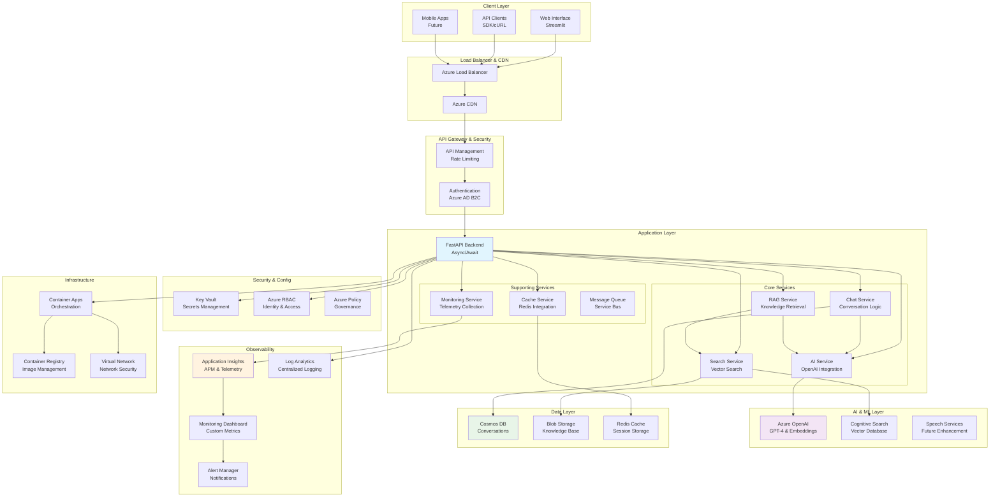
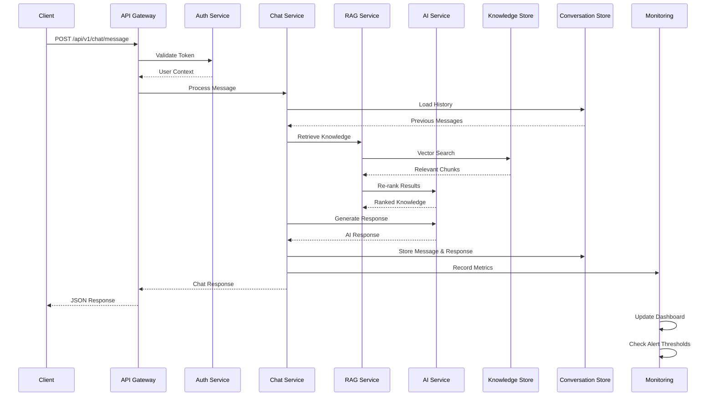
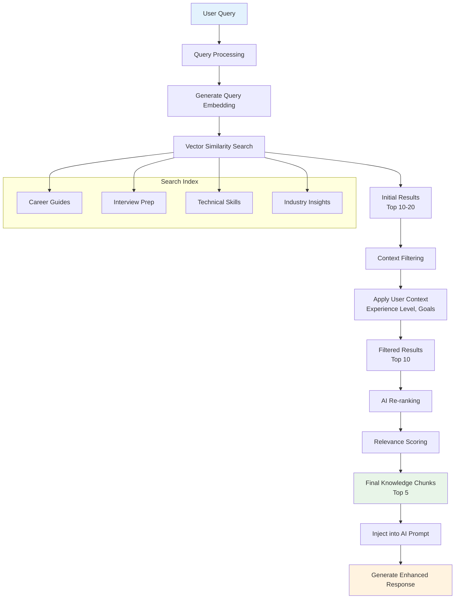

# 🏗️ System Architecture

> **Deep-dive technical architecture** of the AI Career Mentor Chatbot system

## 📋 Table of Contents

- [Architecture Overview](#architecture-overview)
- [System Components](#system-components)
- [Data Flow Architecture](#data-flow-architecture)
- [Technology Stack](#technology-stack)
- [Security Architecture](#security-architecture)
- [Scalability Design](#scalability-design)
- [Monitoring Architecture](#monitoring-architecture)
- [Deployment Architecture](#deployment-architecture)

## 🎯 Architecture Overview

The AI Career Mentor Chatbot employs a **modern microservices architecture** with cloud-native patterns, emphasizing scalability, observability, and maintainability.

### **Architectural Principles**

- **🔄 Event-Driven**: Asynchronous processing with message queues
- **🏗️ Microservices**: Loosely coupled, independently deployable services
- **☁️ Cloud-Native**: Azure-first design with container orchestration
- **📊 Observable**: Comprehensive telemetry and monitoring
- **🔒 Secure-by-Design**: Zero-trust security model
- **⚡ Performance-First**: Async/await patterns with optimized data flow

### **High-Level Architecture Diagram**



## 🧩 System Components

### **1. API Gateway Layer**

**FastAPI Application Server**
```python
# src/main.py - Application entry point
from fastapi import FastAPI, Middleware
from fastapi.middleware.cors import CORSMiddleware
from src.services.monitoring_middleware import MonitoringMiddleware
from src.api.endpoints import chat, health
from src.config.settings import get_settings

def create_application() -> FastAPI:
    """Create and configure FastAPI application."""
    settings = get_settings()
    
    app = FastAPI(
        title="AI Career Mentor Chatbot",
        description="Enterprise AI-powered career guidance system",
        version="1.0.0",
        docs_url="/docs",
        redoc_url="/redoc"
    )
    
    # Middleware stack
    app.add_middleware(MonitoringMiddleware)
    app.add_middleware(
        CORSMiddleware,
        allow_origins=settings.allowed_origins,
        allow_credentials=True,
        allow_methods=["*"],
        allow_headers=["*"]
    )
    
    # Route registration
    app.include_router(chat.router, prefix="/api/v1/chat", tags=["chat"])
    app.include_router(health.router, prefix="/health", tags=["health"])
    
    return app

app = create_application()
```

### **2. Core Business Services**

**Chat Service Architecture**
```python
# src/services/chat_service.py
class ChatService:
    """Orchestrates conversation flow and AI interactions."""
    
    def __init__(self, ai_service: AIService, rag_service: RAGService):
        self.ai_service = ai_service
        self.rag_service = rag_service
        self.conversation_store = ConversationStore()
    
    async def process_message(
        self, 
        message: str, 
        session_id: str,
        context: UserContext
    ) -> ChatResponse:
        """Process user message with RAG enhancement."""
        
        # 1. Load conversation context
        conversation = await self.conversation_store.get_conversation(session_id)
        
        # 2. Enhance with knowledge retrieval
        knowledge_context = await self.rag_service.retrieve_relevant_knowledge(
            query=message,
            context=context
        )
        
        # 3. Generate AI response
        ai_response = await self.ai_service.generate_response(
            message=message,
            conversation_history=conversation.messages,
            knowledge_context=knowledge_context,
            user_context=context
        )
        
        # 4. Store conversation
        await self.conversation_store.add_message(session_id, message, ai_response)
        
        return ai_response
```

**RAG Service Implementation**
```python
# src/services/rag_service.py
class RAGService:
    """Retrieval-Augmented Generation service for knowledge enhancement."""
    
    def __init__(self, search_service: SearchService, ai_service: AIService):
        self.search_service = search_service
        self.ai_service = ai_service
    
    async def retrieve_relevant_knowledge(
        self, 
        query: str, 
        context: UserContext,
        max_results: int = 5
    ) -> List[KnowledgeChunk]:
        """Retrieve and rank relevant knowledge chunks."""
        
        # 1. Generate query embeddings
        query_embedding = await self.ai_service.create_embedding(query)
        
        # 2. Vector similarity search
        search_results = await self.search_service.semantic_search(
            query_vector=query_embedding,
            filters=self._build_context_filters(context),
            top_k=max_results * 2  # Get more for re-ranking
        )
        
        # 3. Re-rank results using AI
        reranked_results = await self._rerank_results(
            query=query,
            results=search_results,
            context=context
        )
        
        return reranked_results[:max_results]
    
    async def _rerank_results(
        self,
        query: str,
        results: List[SearchResult],
        context: UserContext
    ) -> List[KnowledgeChunk]:
        """Re-rank search results using AI for better relevance."""
        
        rerank_prompt = f"""
        User Query: {query}
        User Context: {context.background}, {context.experience_level}
        
        Rank the following knowledge chunks by relevance to the user's query and context:
        {self._format_results_for_ranking(results)}
        
        Return only the most relevant chunks in order of importance.
        """
        
        ranking_response = await self.ai_service.generate_response(
            message=rerank_prompt,
            temperature=0.1,  # Low temperature for consistent ranking
            max_tokens=1000
        )
        
        return self._parse_ranking_response(ranking_response, results)
```

### **3. AI Integration Layer**

**Azure OpenAI Integration**
```python
# src/services/ai_service.py
class AIService:
    """Azure OpenAI integration with advanced prompt engineering."""
    
    def __init__(self, settings: Settings):
        self.client = AsyncAzureOpenAI(
            api_key=settings.azure_openai_api_key,
            api_version=settings.azure_openai_api_version,
            azure_endpoint=settings.azure_openai_endpoint
        )
        self.deployment_name = settings.azure_openai_deployment_name
        self.token_manager = TokenManager()
    
    async def generate_response(
        self,
        message: str,
        conversation_history: List[Message],
        knowledge_context: List[KnowledgeChunk],
        user_context: UserContext,
        **kwargs
    ) -> AIResponse:
        """Generate contextual AI response with token optimization."""
        
        # 1. Build optimized prompt
        system_prompt = self._build_system_prompt(user_context, knowledge_context)
        conversation_prompt = self._build_conversation_prompt(
            conversation_history, 
            message
        )
        
        # 2. Token management and optimization
        total_tokens = self.token_manager.estimate_tokens(
            system_prompt + conversation_prompt
        )
        
        if total_tokens > self.max_context_tokens:
            conversation_prompt = self._truncate_conversation(
                conversation_prompt,
                target_tokens=self.max_context_tokens - len(system_prompt)
            )
        
        # 3. AI generation with streaming
        response = await self.client.chat.completions.create(
            model=self.deployment_name,
            messages=[
                {"role": "system", "content": system_prompt},
                {"role": "user", "content": conversation_prompt}
            ],
            temperature=kwargs.get("temperature", 0.7),
            max_tokens=kwargs.get("max_tokens", 1000),
            stream=True
        )
        
        # 4. Process streaming response
        return await self._process_streaming_response(response)
    
    def _build_system_prompt(
        self, 
        user_context: UserContext, 
        knowledge_context: List[KnowledgeChunk]
    ) -> str:
        """Build sophisticated system prompt with context injection."""
        
        context_info = f"""
        User Profile:
        - Background: {user_context.background}
        - Experience Level: {user_context.experience_level}
        - Career Goals: {', '.join(user_context.career_goals)}
        - Specific Interests: {', '.join(user_context.specific_interests)}
        
        Relevant Knowledge Context:
        {self._format_knowledge_context(knowledge_context)}
        """
        
        return f"""
        You are an expert AI Career Mentor specializing in AI engineering guidance.
        
        {context_info}
        
        Guidelines:
        1. Provide personalized, actionable career advice
        2. Reference specific knowledge sources when relevant
        3. Adapt language and complexity to user's experience level
        4. Focus on practical, implementation-oriented guidance
        5. Encourage continuous learning and skill development
        
        Always maintain a professional, encouraging, and supportive tone.
        """
```

### **4. Data Architecture**

**Conversation Storage Schema**
```python
# src/models/conversation_models.py
class ConversationDocument(BaseModel):
    """Cosmos DB conversation document schema."""
    
    id: str = Field(alias="_id")
    session_id: str
    user_id: Optional[str] = None
    created_at: datetime
    updated_at: datetime
    
    # Conversation metadata
    user_context: UserContext
    conversation_summary: Optional[str] = None
    total_messages: int = 0
    total_tokens_used: int = 0
    
    # Message history
    messages: List[ConversationMessage] = []
    
    # Analytics
    engagement_metrics: EngagementMetrics
    satisfaction_score: Optional[float] = None
    
    class Config:
        """Pydantic configuration."""
        populate_by_name = True
        json_encoders = {
            datetime: lambda v: v.isoformat()
        }

class ConversationMessage(BaseModel):
    """Individual message within a conversation."""
    
    message_id: str
    role: Literal["user", "assistant"]
    content: str
    timestamp: datetime
    
    # Message metadata
    tokens_used: Optional[int] = None
    response_time: Optional[float] = None
    knowledge_sources: List[str] = []
    
    # AI-specific metadata
    model_used: Optional[str] = None
    temperature: Optional[float] = None
    confidence_score: Optional[float] = None
```

**Knowledge Base Schema**
```python
# src/models/knowledge_models.py
class KnowledgeDocument(BaseModel):
    """Azure Cognitive Search knowledge document."""
    
    id: str
    title: str
    content: str
    summary: str
    
    # Content metadata
    document_type: str  # "guide", "faq", "case_study", "resource"
    category: str
    subcategory: Optional[str] = None
    tags: List[str] = []
    
    # Content structure
    content_vector: List[float]  # Embedding vector
    chunk_index: int = 0
    total_chunks: int = 1
    
    # Relevance metadata
    target_audience: List[str] = []  # Experience levels
    career_paths: List[str] = []
    skills_covered: List[str] = []
    
    # Content quality
    authority_score: float = 0.0
    freshness_score: float = 0.0
    engagement_score: float = 0.0
    
    # Administrative
    source_url: Optional[str] = None
    created_at: datetime
    updated_at: datetime
    version: str = "1.0"
```

### **5. Security Architecture**

**Zero-Trust Security Model**
```python
# src/security/auth.py
class SecurityManager:
    """Comprehensive security management."""
    
    def __init__(self, settings: Settings):
        self.key_vault_client = SecretClient(
            vault_url=settings.key_vault_url,
            credential=DefaultAzureCredential()
        )
        self.rbac_client = RBACClient()
        self.rate_limiter = RateLimiter()
    
    async def authenticate_request(self, request: Request) -> UserContext:
        """Multi-layer authentication and authorization."""
        
        # 1. Extract and validate token
        token = self._extract_bearer_token(request.headers.get("Authorization"))
        if not token:
            raise HTTPException(401, "Missing authentication token")
        
        # 2. Validate token signature and expiration
        user_claims = await self._validate_jwt_token(token)
        
        # 3. Check RBAC permissions
        user_permissions = await self.rbac_client.get_user_permissions(
            user_claims["sub"]
        )
        
        # 4. Rate limiting check
        await self.rate_limiter.check_rate_limit(
            user_id=user_claims["sub"],
            request_type=request.method + request.url.path
        )
        
        # 5. Build user context
        return UserContext(
            user_id=user_claims["sub"],
            permissions=user_permissions,
            rate_limit_remaining=self.rate_limiter.get_remaining(user_claims["sub"])
        )
    
    async def _validate_jwt_token(self, token: str) -> Dict[str, Any]:
        """Validate JWT token with Azure AD B2C."""
        try:
            # Get signing keys from Azure AD
            jwks_client = PyJWKClient("https://login.microsoftonline.com/common/discovery/v2.0/keys")
            signing_key = jwks_client.get_signing_key_from_jwt(token)
            
            # Validate and decode token
            payload = jwt.decode(
                token,
                signing_key.key,
                algorithms=["RS256"],
                audience=self.settings.azure_ad_audience,
                issuer=self.settings.azure_ad_issuer
            )
            
            return payload
            
        except jwt.ExpiredSignatureError:
            raise HTTPException(401, "Token has expired")
        except jwt.InvalidTokenError:
            raise HTTPException(401, "Invalid token")
```

## 🔄 Data Flow Architecture

### **Request Processing Flow**



### **Knowledge Retrieval Pipeline**



## 🛠️ Technology Stack Deep Dive

### **Backend Framework: FastAPI**

**Why FastAPI?**
- **⚡ Performance**: ASGI-based async framework with high throughput
- **📖 Auto-Documentation**: Automatic OpenAPI/Swagger generation
- **🔍 Type Safety**: Full Pydantic integration with request/response validation
- **🧪 Testing**: Built-in testing support with async test client
- **🔧 Developer Experience**: Excellent IDE support and debugging

**Implementation Patterns**:
```python
# Dependency injection pattern
async def get_chat_service(
    ai_service: AIService = Depends(get_ai_service),
    rag_service: RAGService = Depends(get_rag_service)
) -> ChatService:
    return ChatService(ai_service, rag_service)

# Route with comprehensive validation
@router.post("/message", response_model=ChatResponse)
async def send_message(
    request: ChatRequest,
    chat_service: ChatService = Depends(get_chat_service),
    current_user: UserContext = Depends(get_current_user)
) -> ChatResponse:
    """Send message to AI assistant with full validation."""
    return await chat_service.process_message(
        message=request.message,
        session_id=request.session_id,
        context=current_user
    )
```

### **AI Integration: Azure OpenAI**

**Advanced Prompt Engineering**:
```python
class PromptTemplate:
    """Sophisticated prompt template system."""
    
    SYSTEM_PROMPT = """
    You are an expert AI Career Mentor with deep expertise in:
    - Software engineering career paths
    - AI/ML engineering specializations  
    - Technical interview preparation
    - Industry trends and opportunities
    
    User Context: {user_context}
    Knowledge Context: {knowledge_context}
    
    Provide personalized, actionable advice that:
    1. Addresses the user's specific experience level
    2. References relevant knowledge sources
    3. Includes practical next steps
    4. Maintains an encouraging, professional tone
    """
    
    @classmethod
    def build_prompt(
        cls,
        user_context: UserContext,
        knowledge_context: List[KnowledgeChunk],
        conversation_history: List[Message]
    ) -> str:
        """Build optimized prompt with context injection."""
        
        context_summary = cls._summarize_context(user_context, knowledge_context)
        conversation_summary = cls._summarize_conversation(conversation_history)
        
        return cls.SYSTEM_PROMPT.format(
            user_context=context_summary,
            knowledge_context=cls._format_knowledge(knowledge_context)
        )
```

### **Vector Search: Azure Cognitive Search**

**Search Index Configuration**:
```json
{
  "name": "knowledge-base-index",
  "fields": [
    {
      "name": "id",
      "type": "Edm.String",
      "key": true,
      "searchable": false
    },
    {
      "name": "content",
      "type": "Edm.String",
      "searchable": true,
      "analyzer": "en.lucene"
    },
    {
      "name": "contentVector",
      "type": "Collection(Edm.Single)",
      "searchable": true,
      "dimensions": 1536,
      "vectorSearchProfile": "vector-profile"
    },
    {
      "name": "category",
      "type": "Edm.String",
      "filterable": true,
      "facetable": true
    },
    {
      "name": "targetAudience",
      "type": "Collection(Edm.String)",
      "filterable": true
    }
  ],
  "vectorSearch": {
    "profiles": [
      {
        "name": "vector-profile",
        "algorithm": "vector-algorithm"
      }
    ],
    "algorithms": [
      {
        "name": "vector-algorithm",
        "kind": "hnsw",
        "hnswParameters": {
          "metric": "cosine",
          "m": 4,
          "efConstruction": 400,
          "efSearch": 500
        }
      }
    ]
  }
}
```

## 📊 Monitoring Architecture

### **Multi-Layer Observability**

```python
# src/services/monitoring_service.py
class MonitoringService:
    """Comprehensive application monitoring."""
    
    def __init__(self):
        self.metrics_collector = MetricsCollector()
        self.trace_exporter = AzureMonitorTraceExporter()
        self.custom_logger = StructuredLogger()
    
    async def track_request(
        self,
        request: Request,
        response_time: float,
        status_code: int,
        user_context: Optional[UserContext] = None
    ):
        """Track HTTP request with full context."""
        
        # Business metrics
        await self.metrics_collector.increment_counter(
            "http_requests_total",
            tags={
                "method": request.method,
                "endpoint": request.url.path,
                "status_code": status_code,
                "user_type": user_context.user_type if user_context else "anonymous"
            }
        )
        
        # Performance metrics
        await self.metrics_collector.record_histogram(
            "http_request_duration_seconds",
            response_time,
            tags={"endpoint": request.url.path}
        )
        
        # Custom telemetry
        self.custom_logger.info(
            "request_processed",
            extra={
                "request_id": request.state.request_id,
                "user_id": user_context.user_id if user_context else None,
                "response_time": response_time,
                "endpoint": request.url.path,
                "status_code": status_code
            }
        )
    
    async def track_ai_usage(
        self,
        model: str,
        tokens_used: int,
        cost_estimate: float,
        response_time: float,
        user_context: UserContext
    ):
        """Track AI service usage and costs."""
        
        # Cost tracking
        await self.metrics_collector.increment_counter(
            "ai_tokens_used_total",
            value=tokens_used,
            tags={
                "model": model,
                "user_type": user_context.user_type
            }
        )
        
        await self.metrics_collector.record_gauge(
            "ai_cost_estimate_usd",
            cost_estimate,
            tags={"model": model}
        )
        
        # Performance tracking
        await self.metrics_collector.record_histogram(
            "ai_response_time_seconds",
            response_time,
            tags={"model": model}
        )
```

### **Real-Time Dashboard Architecture**

**Dashboard Component Structure**:
```javascript
// Monitoring dashboard with live updates
class MonitoringDashboard {
    constructor() {
        this.websocket = new WebSocket('ws://localhost:8000/monitoring/ws');
        this.charts = new Map();
        this.setupCharts();
        this.setupWebSocket();
    }
    
    setupCharts() {
        // Request rate chart
        this.charts.set('requestRate', new Chart('requestRateChart', {
            type: 'line',
            data: {
                labels: [],
                datasets: [{
                    label: 'Requests/min',
                    data: [],
                    borderColor: 'rgb(75, 192, 192)',
                    tension: 0.1
                }]
            },
            options: {
                responsive: true,
                scales: {
                    y: {
                        beginAtZero: true
                    }
                }
            }
        }));
        
        // AI token usage chart
        this.charts.set('tokenUsage', new Chart('tokenUsageChart', {
            type: 'bar',
            data: {
                labels: ['GPT-4', 'Text-Embedding'],
                datasets: [{
                    label: 'Tokens Used',
                    data: [0, 0],
                    backgroundColor: ['rgba(54, 162, 235, 0.8)', 'rgba(255, 99, 132, 0.8)']
                }]
            }
        }));
    }
    
    setupWebSocket() {
        this.websocket.onmessage = (event) => {
            const data = JSON.parse(event.data);
            this.updateCharts(data);
        };
    }
    
    updateCharts(metricsData) {
        // Update request rate chart
        const requestChart = this.charts.get('requestRate');
        requestChart.data.labels.push(new Date().toLocaleTimeString());
        requestChart.data.datasets[0].data.push(metricsData.requestRate);
        
        // Keep only last 20 data points
        if (requestChart.data.labels.length > 20) {
            requestChart.data.labels.shift();
            requestChart.data.datasets[0].data.shift();
        }
        
        requestChart.update();
        
        // Update token usage
        const tokenChart = this.charts.get('tokenUsage');
        tokenChart.data.datasets[0].data = [
            metricsData.gpt4TokensUsed,
            metricsData.embeddingTokensUsed
        ];
        tokenChart.update();
    }
}
```

## 🚀 Scalability Design

### **Horizontal Scaling Strategy**

**Container Apps Auto-Scaling Configuration**:
```yaml
# Azure Container Apps scaling rules
scale:
  minReplicas: 2
  maxReplicas: 100
  
  rules:
    - name: "http-requests"
      http:
        metadata:
          concurrentRequests: "50"
    
    - name: "cpu-utilization"
      custom:
        type: "cpu"
        metadata:
          type: "Utilization"
          value: "70"
    
    - name: "memory-utilization"  
      custom:
        type: "memory"
        metadata:
          type: "Utilization"
          value: "80"
    
    - name: "queue-length"
      azureServiceBus:
        metadata:
          connectionFromEnv: "SERVICE_BUS_CONNECTION"
          queueName: "chat-processing"
          messageCount: "10"
```

### **Performance Optimization Patterns**

**Connection Pooling and Caching**:
```python
# src/config/performance.py
class PerformanceOptimizer:
    """Application performance optimization."""
    
    def __init__(self, settings: Settings):
        # HTTP client with connection pooling
        self.http_client = httpx.AsyncClient(
            limits=httpx.Limits(
                max_keepalive_connections=20,
                max_connections=100,
                keepalive_expiry=30.0
            ),
            timeout=httpx.Timeout(30.0)
        )
        
        # Redis connection pool
        self.redis_pool = redis.ConnectionPool(
            host=settings.redis_host,
            port=settings.redis_port,
            max_connections=50,
            retry_on_timeout=True
        )
        
        # Cosmos DB connection optimization
        self.cosmos_client = CosmosClient(
            settings.cosmos_endpoint,
            settings.cosmos_key,
            connection_policy=ConnectionPolicy(
                request_timeout=30000,
                max_pool_size=50,
                max_retry_attempts_on_throttled_requests=3
            )
        )
    
    async def cache_response(
        self,
        cache_key: str,
        response_data: Any,
        ttl_seconds: int = 300
    ):
        """Cache response with intelligent TTL."""
        
        redis_client = redis.Redis(connection_pool=self.redis_pool)
        
        # Serialize with compression for large responses
        serialized_data = await self._serialize_and_compress(response_data)
        
        await redis_client.setex(
            cache_key,
            ttl_seconds,
            serialized_data
        )
    
    async def get_cached_response(self, cache_key: str) -> Optional[Any]:
        """Retrieve cached response with decompression."""
        
        redis_client = redis.Redis(connection_pool=self.redis_pool)
        cached_data = await redis_client.get(cache_key)
        
        if cached_data:
            return await self._decompress_and_deserialize(cached_data)
        
        return None
```

---

## 🔗 Integration Points

### **External Service Integration**

**Azure Service Integration Map**:
- **Azure OpenAI**: AI text generation and embeddings
- **Cognitive Search**: Vector similarity search and full-text search
- **Cosmos DB**: NoSQL document storage for conversations
- **Key Vault**: Centralized secrets management
- **Application Insights**: APM and custom telemetry
- **Container Registry**: Docker image storage and management
- **Container Apps**: Serverless container orchestration
- **Service Bus**: Asynchronous message processing
- **Blob Storage**: Knowledge base document storage

### **API Integration Patterns**

**Circuit Breaker Pattern Implementation**:
```python
# src/utils/circuit_breaker.py
class CircuitBreaker:
    """Circuit breaker for external service resilience."""
    
    def __init__(
        self,
        failure_threshold: int = 5,
        recovery_timeout: int = 60,
        expected_exception: Type[Exception] = Exception
    ):
        self.failure_threshold = failure_threshold
        self.recovery_timeout = recovery_timeout
        self.expected_exception = expected_exception
        
        self.failure_count = 0
        self.last_failure_time = None
        self.state = "CLOSED"  # CLOSED, OPEN, HALF_OPEN
    
    async def call(self, func: Callable, *args, **kwargs):
        """Execute function with circuit breaker protection."""
        
        if self.state == "OPEN":
            if self._should_attempt_reset():
                self.state = "HALF_OPEN"
            else:
                raise CircuitBreakerOpenException("Circuit breaker is OPEN")
        
        try:
            result = await func(*args, **kwargs)
            self._on_success()
            return result
            
        except self.expected_exception as e:
            self._on_failure()
            raise e
    
    def _on_success(self):
        """Handle successful call."""
        self.failure_count = 0
        self.state = "CLOSED"
    
    def _on_failure(self):
        """Handle failed call."""
        self.failure_count += 1
        self.last_failure_time = time.time()
        
        if self.failure_count >= self.failure_threshold:
            self.state = "OPEN"
```

This architecture demonstrates enterprise-grade system design with comprehensive observability, security, and scalability patterns. The system is built to handle production workloads while maintaining high availability and performance standards.

---

## 📞 Architecture Support

- **🔧 System Design Questions**: [GitHub Discussions](https://github.com/scott-ai-maker/ai-powered-chatbot/discussions)
- **📖 Azure Architecture**: [Azure Well-Architected Framework](https://docs.microsoft.com/en-us/azure/architecture/framework/)
- **🏗️ Enterprise Architecture**: scott.ai.maker@example.com