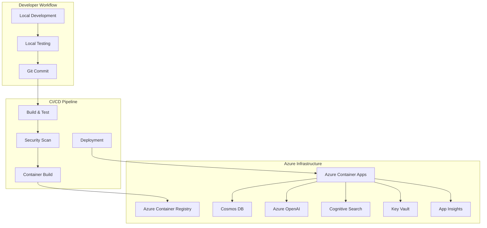

# 🚀 Deployment Guide

> **Complete deployment instructions** for the AI Career Mentor Chatbot across all environments

## 📋 Table of Contents

- [Overview](#overview)
- [Prerequisites](#prerequisites)
- [Local Development](#local-development)
- [Azure Infrastructure](#azure-infrastructure)
- [Container Deployment](#container-deployment)
- [CI/CD Pipeline](#cicd-pipeline)
- [Environment Configuration](#environment-configuration)
- [Monitoring Setup](#monitoring-setup)
- [Troubleshooting](#troubleshooting)

## 🎯 Overview

This guide covers comprehensive deployment scenarios:

- **🏠 Local Development**: Development environment setup
- **☁️ Azure Cloud**: Production-ready cloud deployment
- **🐳 Container**: Docker containerization and orchestration
- **🔄 CI/CD**: Automated deployment pipelines
- **📊 Monitoring**: Observability and alerting setup

### Deployment Architecture



## 📋 Prerequisites

### Required Tools

| Tool | Version | Purpose | Installation |
|------|---------|---------|--------------|
| **Python** | 3.12+ | Runtime environment | [Download](https://python.org/downloads/) |
| **Azure CLI** | 2.50+ | Azure resource management | [Install Guide](https://docs.microsoft.com/en-us/cli/azure/install-azure-cli) |
| **Docker** | 20.10+ | Containerization | [Install Guide](https://docs.docker.com/get-docker/) |
| **Git** | 2.30+ | Version control | [Download](https://git-scm.com/downloads) |
| **Bicep CLI** | 0.20+ | Infrastructure as Code | [Install Guide](https://docs.microsoft.com/en-us/azure/azure-resource-manager/bicep/install) |

### Azure Prerequisites

**Required Azure Services**:
- Azure subscription with Contributor access
- Azure OpenAI service (GPT-4 model deployment)
- Azure Cognitive Search service
- Azure Cosmos DB account
- Azure Container Registry
- Azure Container Apps environment
- Azure Key Vault
- Azure Application Insights

**Service Quotas to Verify**:
```bash
# Check Azure OpenAI quota
az cognitiveservices account list-usage \
  --name your-openai-service \
  --resource-group your-rg

# Check Container Apps quota
az containerapp env list --resource-group your-rg
```

## 🏠 Local Development

### Environment Setup

1. **Clone Repository**
   ```bash
   git clone https://github.com/scott-ai-maker/ai-powered-chatbot.git
   cd ai-powered-chatbot
   ```

2. **Python Environment**
   ```bash
   # Create virtual environment
   python -m venv venv
   
   # Activate environment
   source venv/bin/activate  # Linux/macOS
   # venv\Scripts\activate   # Windows
   
   # Upgrade pip
   pip install --upgrade pip
   
   # Install dependencies
   pip install -r requirements.txt
   pip install -r requirements-dev.txt
   ```

3. **Environment Configuration**
   ```bash
   # Copy environment template
   cp .env.example .env
   
   # Edit configuration (see Environment Configuration section)
   nano .env
   ```

4. **Azure Services Setup**
   ```bash
   # Login to Azure
   az login
   
   # Set subscription
   az account set --subscription "your-subscription-id"
   
   # Create resource group (if needed)
   az group create --name ai-chatbot-dev-rg --location eastus
   ```

### Local Development Server

**Start the FastAPI Backend**:
```bash
# Development server with hot reload
uvicorn src.main:app --reload --host 0.0.0.0 --port 8000

# Alternative using Python
python -m src.main

# With specific environment
ENVIRONMENT=development uvicorn src.main:app --reload
```

**Start the Streamlit Frontend**:
```bash
# In a separate terminal
streamlit run demo_frontend_app.py --server.port 8501

# With custom configuration
streamlit run demo_frontend_app.py --server.port 8501 --server.address 0.0.0.0
```

**Access Applications**:
- API Server: http://localhost:8000
- API Documentation: http://localhost:8000/docs
- Streamlit Frontend: http://localhost:8501
- Monitoring Dashboard: http://localhost:8000/monitoring/dashboard

### Local Testing

```bash
# Run complete test suite
pytest --cov=src --cov-report=html --cov-report=term-missing

# Run specific test categories
pytest tests/unit/                    # Unit tests
pytest tests/integration/             # Integration tests
pytest -m "not slow"                 # Skip slow tests

# Run with specific markers
pytest -m "chat" tests/               # Chat-related tests
pytest -m "monitoring" tests/         # Monitoring tests

# Generate test report
pytest --html=reports/test-report.html --self-contained-html
```

### Code Quality Checks

```bash
# Format code
black src/ tests/
isort src/ tests/

# Lint code
flake8 src/ tests/
mypy src/

# Security scan
bandit -r src/
safety check

# Pre-commit hooks
pre-commit run --all-files
```

## ☁️ Azure Infrastructure

### One-Click Infrastructure Deployment

**Automated Setup Script**:
```bash
# Navigate to infrastructure scripts
cd infrastructure/scripts

# Make scripts executable
chmod +x setup.sh deploy.sh

# Run complete infrastructure setup
./setup.sh

# Deploy application
./deploy.sh
```

### Manual Infrastructure Deployment

**Step 1: Resource Group Creation**
```bash
# Create production resource group
az group create \
  --name ai-chatbot-prod-rg \
  --location eastus \
  --tags Environment=Production Project=AI-Chatbot

# Create staging resource group
az group create \
  --name ai-chatbot-staging-rg \
  --location eastus \
  --tags Environment=Staging Project=AI-Chatbot
```

**Step 2: Key Vault Setup**
```bash
# Create Key Vault
az keyvault create \
  --name ai-chatbot-kv-prod \
  --resource-group ai-chatbot-prod-rg \
  --location eastus \
  --sku standard \
  --enable-rbac-authorization

# Add secrets
az keyvault secret set \
  --vault-name ai-chatbot-kv-prod \
  --name "AzureOpenAI-ApiKey" \
  --value "your-openai-api-key"

az keyvault secret set \
  --vault-name ai-chatbot-kv-prod \
  --name "CosmosDB-ConnectionString" \
  --value "your-cosmos-connection-string"
```

**Step 3: Bicep Infrastructure Deployment**
```bash
# Navigate to Bicep templates
cd infrastructure/bicep

# Validate template
az deployment group validate \
  --resource-group ai-chatbot-prod-rg \
  --template-file main.bicep \
  --parameters @parameters.prod.json

# Deploy infrastructure
az deployment group create \
  --resource-group ai-chatbot-prod-rg \
  --template-file main.bicep \
  --parameters @parameters.prod.json \
  --mode Incremental
```

**Step 4: Azure OpenAI Setup**
```bash
# Create Azure OpenAI service
az cognitiveservices account create \
  --name ai-chatbot-openai-prod \
  --resource-group ai-chatbot-prod-rg \
  --location eastus \
  --kind OpenAI \
  --sku S0

# Deploy GPT-4 model
az cognitiveservices account deployment create \
  --name ai-chatbot-openai-prod \
  --resource-group ai-chatbot-prod-rg \
  --deployment-name gpt-4 \
  --model-name gpt-4 \
  --model-version "1106-Preview" \
  --model-format OpenAI \
  --sku-capacity 10 \
  --sku-name "Standard"
```

**Step 5: Cosmos DB Setup**
```bash
# Create Cosmos DB account
az cosmosdb create \
  --name ai-chatbot-cosmos-prod \
  --resource-group ai-chatbot-prod-rg \
  --default-consistency-level Session \
  --locations regionName=eastus failoverPriority=0 isZoneRedundant=false

# Create database and container
az cosmosdb sql database create \
  --account-name ai-chatbot-cosmos-prod \
  --resource-group ai-chatbot-prod-rg \
  --name chatbot-db

az cosmosdb sql container create \
  --account-name ai-chatbot-cosmos-prod \
  --resource-group ai-chatbot-prod-rg \
  --database-name chatbot-db \
  --name conversations \
  --partition-key-path "/session_id" \
  --throughput 400
```

## 🐳 Container Deployment

### Docker Image Building

**Multi-stage Dockerfile Optimization**:
```dockerfile
# Build stage
FROM python:3.12-slim as builder
WORKDIR /app
COPY requirements.txt .
RUN pip install --no-cache-dir --user -r requirements.txt

# Production stage
FROM python:3.12-slim
WORKDIR /app
COPY --from=builder /root/.local /root/.local
COPY src/ ./src/
COPY pyproject.toml .
ENV PATH=/root/.local/bin:$PATH
EXPOSE 8000
CMD ["uvicorn", "src.main:app", "--host", "0.0.0.0", "--port", "8000"]
```

**Build and Push Container**:
```bash
# Build multi-platform image
docker buildx build \
  --platform linux/amd64,linux/arm64 \
  --tag ai-chatbot:latest \
  --tag ai-chatbot:v1.0.0 \
  .

# Tag for Azure Container Registry
docker tag ai-chatbot:latest <registry>.azurecr.io/ai-chatbot:latest
docker tag ai-chatbot:latest <registry>.azurecr.io/ai-chatbot:v1.0.0

# Login to ACR
az acr login --name <registry>

# Push to registry
docker push <registry>.azurecr.io/ai-chatbot:latest
docker push <registry>.azurecr.io/ai-chatbot:v1.0.0
```

### Azure Container Apps Deployment

**Container App Creation**:
```bash
# Create Container Apps environment
az containerapp env create \
  --name ai-chatbot-env-prod \
  --resource-group ai-chatbot-prod-rg \
  --location eastus \
  --logs-workspace-id <workspace-id>

# Deploy container app
az containerapp create \
  --name ai-chatbot-app \
  --resource-group ai-chatbot-prod-rg \
  --environment ai-chatbot-env-prod \
  --image <registry>.azurecr.io/ai-chatbot:latest \
  --target-port 8000 \
  --ingress external \
  --min-replicas 1 \
  --max-replicas 10 \
  --cpu 1.0 \
  --memory 2Gi \
  --env-vars \
    ENVIRONMENT=production \
    AZURE_OPENAI_ENDPOINT=<openai-endpoint> \
    COSMOS_DB_ENDPOINT=<cosmos-endpoint>
```

**Container App Update**:
```bash
# Update with new image
az containerapp update \
  --name ai-chatbot-app \
  --resource-group ai-chatbot-prod-rg \
  --image <registry>.azurecr.io/ai-chatbot:v1.1.0

# Update environment variables
az containerapp update \
  --name ai-chatbot-app \
  --resource-group ai-chatbot-prod-rg \
  --set-env-vars LOG_LEVEL=INFO MONITORING_ENABLED=true

# Scale application
az containerapp update \
  --name ai-chatbot-app \
  --resource-group ai-chatbot-prod-rg \
  --min-replicas 2 \
  --max-replicas 20
```

### Container Health Monitoring

**Health Check Configuration**:
```yaml
# container-health.yaml
healthCheck:
  httpGet:
    path: /health/ready
    port: 8000
    scheme: HTTP
  initialDelaySeconds: 30
  periodSeconds: 10
  timeoutSeconds: 5
  failureThreshold: 3
  successThreshold: 1

livenessProbe:
  httpGet:
    path: /health/live
    port: 8000
  initialDelaySeconds: 60
  periodSeconds: 30
  timeoutSeconds: 10
  failureThreshold: 3
```

## 🔄 CI/CD Pipeline

### GitHub Actions Workflow

**Complete CI/CD Pipeline** (`.github/workflows/ci-cd.yml`):
```yaml
name: CI/CD Pipeline

on:
  push:
    branches: [main, develop]
  pull_request:
    branches: [main]

env:
  REGISTRY: your-registry.azurecr.io
  IMAGE_NAME: ai-chatbot

jobs:
  test:
    runs-on: ubuntu-latest
    steps:
      - uses: actions/checkout@v4
      
      - name: Set up Python
        uses: actions/setup-python@v4
        with:
          python-version: '3.12'
          
      - name: Install dependencies
        run: |
          pip install -r requirements.txt
          pip install -r requirements-dev.txt
          
      - name: Run tests
        run: |
          pytest --cov=src --cov-report=xml
          
      - name: Security scan
        run: |
          bandit -r src/
          safety check
          
      - name: Upload coverage
        uses: codecov/codecov-action@v3

  build:
    needs: test
    runs-on: ubuntu-latest
    if: github.ref == 'refs/heads/main'
    
    steps:
      - uses: actions/checkout@v4
      
      - name: Login to ACR
        uses: azure/docker-login@v1
        with:
          login-server: ${{ env.REGISTRY }}
          username: ${{ secrets.AZURE_CLIENT_ID }}
          password: ${{ secrets.AZURE_CLIENT_SECRET }}
          
      - name: Build and push
        run: |
          docker build -t ${{ env.REGISTRY }}/${{ env.IMAGE_NAME }}:${{ github.sha }} .
          docker push ${{ env.REGISTRY }}/${{ env.IMAGE_NAME }}:${{ github.sha }}
          
      - name: Deploy to Azure
        uses: azure/container-apps-deploy-action@v1
        with:
          containerAppName: ai-chatbot-app
          resourceGroup: ai-chatbot-prod-rg
          imageToDeploy: ${{ env.REGISTRY }}/${{ env.IMAGE_NAME }}:${{ github.sha }}
```

### Manual Deployment Commands

**Build and Deploy Script**:
```bash
#!/bin/bash
# deploy.sh

set -e

echo "🚀 Starting deployment process..."

# Variables
RESOURCE_GROUP="ai-chatbot-prod-rg"
CONTAINER_APP_NAME="ai-chatbot-app"
REGISTRY="your-registry.azurecr.io"
IMAGE_NAME="ai-chatbot"
VERSION=$(git rev-parse --short HEAD)

# Build and push container
echo "📦 Building container image..."
docker build -t $REGISTRY/$IMAGE_NAME:$VERSION .
docker build -t $REGISTRY/$IMAGE_NAME:latest .

echo "📤 Pushing to registry..."
az acr login --name $(echo $REGISTRY | cut -d'.' -f1)
docker push $REGISTRY/$IMAGE_NAME:$VERSION
docker push $REGISTRY/$IMAGE_NAME:latest

# Deploy to Azure Container Apps
echo "🚀 Deploying to Azure Container Apps..."
az containerapp update \
  --name $CONTAINER_APP_NAME \
  --resource-group $RESOURCE_GROUP \
  --image $REGISTRY/$IMAGE_NAME:$VERSION

# Verify deployment
echo "✅ Verifying deployment..."
az containerapp show \
  --name $CONTAINER_APP_NAME \
  --resource-group $RESOURCE_GROUP \
  --query "properties.configuration.ingress.fqdn" \
  --output tsv

echo "🎉 Deployment completed successfully!"
```

## ⚙️ Environment Configuration

### Environment Files

**Production Environment** (`.env.prod`):
```bash
# Application Settings
ENVIRONMENT=production
LOG_LEVEL=INFO
DEBUG=false

# Azure OpenAI
AZURE_OPENAI_ENDPOINT=https://your-openai.openai.azure.com/
AZURE_OPENAI_DEPLOYMENT_NAME=gpt-4
AZURE_OPENAI_API_VERSION=2024-02-15-preview

# Azure Cognitive Search
AZURE_SEARCH_ENDPOINT=https://your-search.search.windows.net
AZURE_SEARCH_INDEX_NAME=knowledge-base
AZURE_SEARCH_API_VERSION=2023-11-01

# Azure Cosmos DB
COSMOS_DB_ENDPOINT=https://your-cosmos.documents.azure.com:443/
COSMOS_DB_DATABASE_NAME=chatbot-db
COSMOS_DB_CONTAINER_NAME=conversations

# Monitoring
AZURE_APPLICATION_INSIGHTS_CONNECTION_STRING=InstrumentationKey=your-key
MONITORING_ENABLED=true
MONITORING_COLLECTION_INTERVAL=60

# Security
ALLOWED_ORIGINS=https://your-domain.com
CORS_ENABLED=true
API_KEY_REQUIRED=true

# Performance
MAX_TOKENS_PER_REQUEST=4000
REQUEST_TIMEOUT_SECONDS=30
CONNECTION_POOL_SIZE=20
```

**Staging Environment** (`.env.staging`):
```bash
# Application Settings
ENVIRONMENT=staging
LOG_LEVEL=DEBUG
DEBUG=true

# Use staging Azure resources
AZURE_OPENAI_ENDPOINT=https://your-openai-staging.openai.azure.com/
COSMOS_DB_ENDPOINT=https://your-cosmos-staging.documents.azure.com:443/

# Relaxed security for testing
ALLOWED_ORIGINS=*
API_KEY_REQUIRED=false
```

### Secrets Management

**Azure Key Vault Integration**:
```bash
# Store secrets in Key Vault
az keyvault secret set \
  --vault-name ai-chatbot-kv-prod \
  --name "AzureOpenAI-ApiKey" \
  --value "your-secret-key"

# Reference in Container Apps
az containerapp update \
  --name ai-chatbot-app \
  --resource-group ai-chatbot-prod-rg \
  --secrets \
    openai-key=keyvaultref:https://ai-chatbot-kv-prod.vault.azure.net/secrets/AzureOpenAI-ApiKey,identityref:system \
  --env-vars \
    AZURE_OPENAI_API_KEY=secretref:openai-key
```

### Configuration Validation

**Environment Validation Script**:
```python
# scripts/validate_config.py
import os
import sys
from typing import List, Tuple

def validate_environment() -> List[Tuple[str, bool, str]]:
    """Validate required environment variables."""
    required_vars = [
        ("AZURE_OPENAI_ENDPOINT", True, "Azure OpenAI service endpoint"),
        ("AZURE_OPENAI_API_KEY", True, "Azure OpenAI API key"),
        ("COSMOS_DB_ENDPOINT", True, "Cosmos DB endpoint"),
        ("AZURE_SEARCH_ENDPOINT", True, "Cognitive Search endpoint"),
        ("ENVIRONMENT", False, "Runtime environment"),
    ]
    
    results = []
    for var_name, required, description in required_vars:
        value = os.getenv(var_name)
        is_set = value is not None and value.strip() != ""
        
        if required and not is_set:
            print(f"❌ {var_name}: {description} (REQUIRED)")
            results.append((var_name, False, description))
        elif is_set:
            print(f"✅ {var_name}: Set")
            results.append((var_name, True, description))
        else:
            print(f"⚠️  {var_name}: Not set (optional)")
            results.append((var_name, True, description))
    
    return results

if __name__ == "__main__":
    results = validate_environment()
    missing_required = [r for r in results if not r[1]]
    
    if missing_required:
        print(f"\n❌ {len(missing_required)} required variables missing")
        sys.exit(1)
    else:
        print(f"\n✅ All required variables configured")
        sys.exit(0)
```

## 📊 Monitoring Setup

### Application Insights Configuration

**Instrumentation Setup**:
```python
# src/config/monitoring.py
from azure.monitor.opentelemetry import configure_azure_monitor
from opentelemetry import trace, metrics
from opentelemetry.instrumentation.fastapi import FastAPIInstrumentor
from opentelemetry.instrumentation.requests import RequestsInstrumentor

def setup_monitoring(app):
    """Configure Azure Application Insights monitoring."""
    # Configure Azure Monitor
    configure_azure_monitor(
        connection_string=os.getenv("AZURE_APPLICATION_INSIGHTS_CONNECTION_STRING")
    )
    
    # Instrument FastAPI
    FastAPIInstrumentor.instrument_app(app)
    RequestsInstrumentor().instrument()
    
    # Custom metrics
    meter = metrics.get_meter(__name__)
    request_counter = meter.create_counter(
        "http_requests_total",
        description="Total HTTP requests"
    )
    
    return request_counter
```

### Monitoring Dashboard Deployment

**Dashboard Container App**:
```bash
# Deploy monitoring dashboard as separate container app
az containerapp create \
  --name ai-chatbot-monitoring \
  --resource-group ai-chatbot-prod-rg \
  --environment ai-chatbot-env-prod \
  --image <registry>.azurecr.io/ai-chatbot-monitoring:latest \
  --target-port 3000 \
  --ingress external \
  --min-replicas 1 \
  --max-replicas 2 \
  --env-vars \
    MONITORING_API_ENDPOINT=https://ai-chatbot-app.azurecontainerapps.io
```

### Alert Configuration

**Azure Monitor Alerts**:
```bash
# Create action group for notifications
az monitor action-group create \
  --name ai-chatbot-alerts \
  --resource-group ai-chatbot-prod-rg \
  --short-name chatbot \
  --email-receivers \
    name=admin email=admin@company.com

# Create metric alert for high error rate
az monitor metrics alert create \
  --name "High Error Rate" \
  --resource-group ai-chatbot-prod-rg \
  --scopes "/subscriptions/.../resourceGroups/ai-chatbot-prod-rg/providers/Microsoft.App/containerApps/ai-chatbot-app" \
  --condition "avg requests/failed > 0.05" \
  --description "Alert when error rate exceeds 5%" \
  --evaluation-frequency 1m \
  --window-size 5m \
  --severity 2 \
  --action-groups ai-chatbot-alerts
```

## 🔧 Troubleshooting

### Common Deployment Issues

**1. Container App Not Starting**
```bash
# Check container app status
az containerapp show \
  --name ai-chatbot-app \
  --resource-group ai-chatbot-prod-rg \
  --query "properties.runningStatus"

# View container logs
az containerapp logs show \
  --name ai-chatbot-app \
  --resource-group ai-chatbot-prod-rg \
  --follow

# Check revision status
az containerapp revision list \
  --name ai-chatbot-app \
  --resource-group ai-chatbot-prod-rg \
  --query "[].{Name:name,Active:properties.active,Status:properties.runningState}"
```

**2. Environment Variable Issues**
```bash
# List current environment variables
az containerapp show \
  --name ai-chatbot-app \
  --resource-group ai-chatbot-prod-rg \
  --query "properties.template.containers[0].env"

# Update environment variable
az containerapp update \
  --name ai-chatbot-app \
  --resource-group ai-chatbot-prod-rg \
  --set-env-vars LOG_LEVEL=DEBUG
```

**3. Network Connectivity Issues**
```bash
# Check ingress configuration
az containerapp ingress show \
  --name ai-chatbot-app \
  --resource-group ai-chatbot-prod-rg

# Test connectivity
curl -I https://ai-chatbot-app.azurecontainerapps.io/health

# Check DNS resolution
nslookup ai-chatbot-app.azurecontainerapps.io
```

**4. Azure Service Authentication**
```bash
# Test Azure OpenAI connection
curl -H "api-key: your-key" \
  "https://your-openai.openai.azure.com/openai/deployments/gpt-4/chat/completions?api-version=2024-02-15-preview"

# Check Cosmos DB connectivity
az cosmosdb check-name-exists --name your-cosmos-account

# Verify Key Vault access
az keyvault secret show \
  --vault-name ai-chatbot-kv-prod \
  --name "AzureOpenAI-ApiKey"
```

### Performance Optimization

**Container Resource Tuning**:
```bash
# Monitor resource usage
az containerapp show \
  --name ai-chatbot-app \
  --resource-group ai-chatbot-prod-rg \
  --query "properties.template.containers[0].resources"

# Update resource allocation
az containerapp update \
  --name ai-chatbot-app \
  --resource-group ai-chatbot-prod-rg \
  --cpu 2.0 \
  --memory 4Gi

# Configure auto-scaling
az containerapp update \
  --name ai-chatbot-app \
  --resource-group ai-chatbot-prod-rg \
  --min-replicas 2 \
  --max-replicas 10 \
  --scale-rule-name http-requests \
  --scale-rule-type http \
  --scale-rule-metadata concurrentRequests=100
```

### Rollback Procedures

**Container App Rollback**:
```bash
# List revisions
az containerapp revision list \
  --name ai-chatbot-app \
  --resource-group ai-chatbot-prod-rg

# Rollback to previous revision
az containerapp revision activate \
  --name ai-chatbot-app \
  --resource-group ai-chatbot-prod-rg \
  --revision <previous-revision-name>

# Deactivate current revision
az containerapp revision deactivate \
  --name ai-chatbot-app \
  --resource-group ai-chatbot-prod-rg \
  --revision <current-revision-name>
```

### Monitoring and Debugging

**Application Insights Query Examples**:
```kusto
// Application performance
requests
| where timestamp > ago(1h)
| summarize avg(duration), count() by bin(timestamp, 5m)
| render timechart

// Error analysis
exceptions
| where timestamp > ago(24h)
| summarize count() by type, outerMessage
| order by count_ desc

// Custom telemetry
customMetrics
| where name == "ai_tokens_used"
| summarize sum(value) by bin(timestamp, 1h)
| render columnchart
```

---

## 📞 Support & Resources

- **🐛 Deployment Issues**: [GitHub Issues](https://github.com/scott-ai-maker/ai-powered-chatbot/issues)
- **📖 Azure Documentation**: [Azure Container Apps](https://docs.microsoft.com/en-us/azure/container-apps/)
- **💬 Community Support**: [GitHub Discussions](https://github.com/scott-ai-maker/ai-powered-chatbot/discussions)
- **🔧 Enterprise Support**: scott.ai.maker@example.com

For additional deployment assistance or custom enterprise deployment scenarios, please contact the development team.